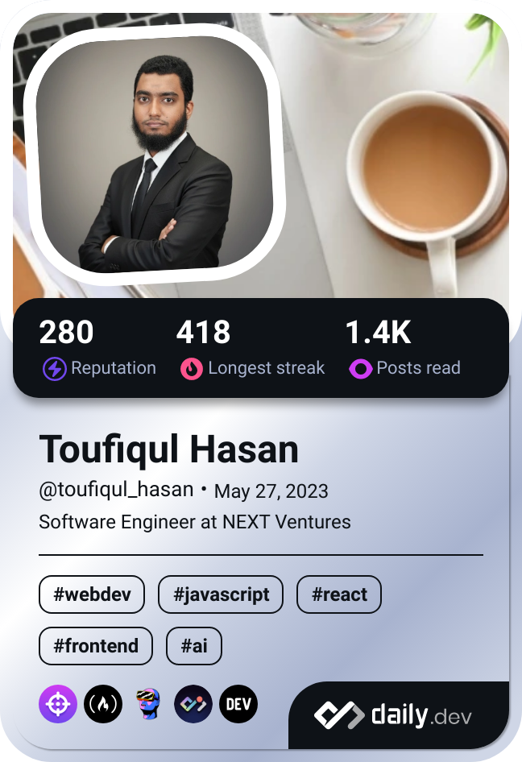

 

<h1 align="center">
  
</h1>

“Any fool can write code that a computer can understand. Good programmers write code that humans can understand.” – Martin Fowler

## :computer: Languages & Tools

 

   
   
   
   
   
   
  
  
   
   
   
   
   
   
   
   
   
  
  

## :chart_with_upwards_trend: Current Statistics

 

<table width="100%" align="center">
  <tr>
    <td>
    
    </td>
    <td>
      
    </td>
  </tr>
</table>
<table width="100%" align="center">
  <tr>
    <td>
    
    </td>
    <td>
    
    </td>
  </tr>
</table>
<table width="100%" align="center">
  <tr>
    <td>
    
    </td>
  </tr>
<table>

## :iphone: Contact With Me

 

  
  
  
  
  
  

 

  

